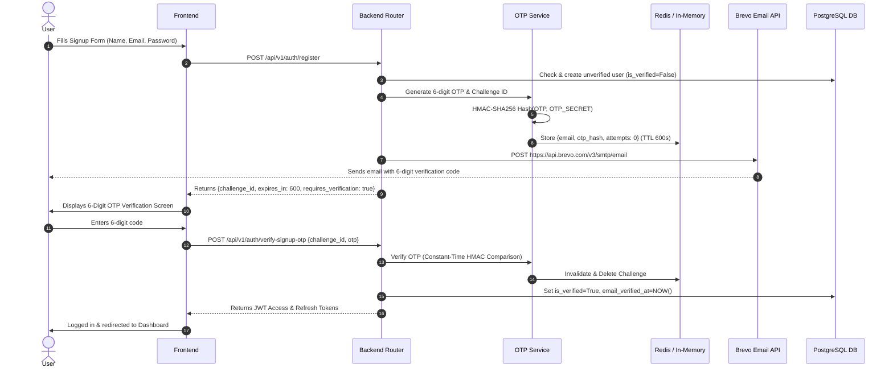

# Brevo Email OTP Verification System

This document outlines the implementation of the secure **Email OTP Verification System** for user registration in the Campus Resource Sharing System (CRSS) using Brevo's Transactional Email API.

---

## 1. Overview & Security Architecture

When a user registers for an account using a campus email address, an account is created in an unverified state (`is_verified = False`). A cryptographically secure 6-digit OTP is generated and dispatched via the Brevo API. Account features and normal login are blocked until successful OTP verification.



### Key Security Features
- **Cryptographically Secure Random Generation**: Uses Python's `secrets.randbelow(1000000)` to generate 6-digit OTPs with leading zeros (`000000`–`999999`).
- **HMAC-SHA256 Hashing**: Raw OTPs are **never stored** in the database, Redis, or logs. Only the HMAC-SHA256 hash computed with `OTP_SECRET` is retained temporarily.
- **Constant-Time Comparison**: Hash verification uses `hmac.compare_digest` to prevent timing side-channel attacks.
- **Automatic Expiration & Rate Limiting**: OTP challenges expire after 10 minutes (600s). Resend requests are subject to a 60-second cooldown per email/IP.
- **Maximum Attempt Lockout**: Up to 5 failed attempts are allowed per challenge. Reaching 5 failed attempts invalidates the challenge immediately.
- **Immediate One-Time Invalidation**: Verified challenges are deleted immediately upon success to prevent replay attacks.

---

## 2. File Index

### Files Created
1. `backend/app/services/otp_service.py` - Core OTP generation, HMAC hashing, challenge tracking, Redis storage, rate limiting, and verification logic.
2. `backend/alembic/versions/8f2a5c1e9b3d_add_email_verification.py` - Database migration adding `email_verified_at` column to `users`.
3. `frontend/src/components/VerificationCodeInput.jsx` - Interactive 6-digit OTP entry component with live expiry and resend cooldown timers.
4. `backend/tests/test_email_verification.py` - Complete test suite covering 18 test scenarios.
5. `docs/EMAIL_OTP_VERIFICATION.md` - Technical specification and documentation (this document).

### Files Modified
1. `backend/app/core/config.py` - Added Brevo and OTP environment configuration settings.
2. `.env` & `.env.example` - Added Brevo API key, sender parameters, and OTP security configuration.
3. `backend/app/models/user.py` - Added `email_verified_at` timestamp column to `User` model.
4. `backend/app/schemas/user.py` - Added Pydantic schemas for OTP registration, verification, and resend.
5. `backend/app/services/email_service.py` - Added `send_brevo_otp_email(...)` integration using `httpx`.
6. `backend/app/routers/auth.py` - Updated `/auth/register` and `/auth/login`, added `/auth/verify-signup-otp` and `/auth/resend-signup-otp`.
7. `backend/app/routers/borrow.py` - Standardized datetime tzinfo subtractions.
8. `frontend/src/api/endpoints.js` - Added `verifySignupOtp` and `resendSignupOtp` API endpoints.
9. `frontend/src/context/AuthContext.jsx` - Added `verifySignupOtp` and `resendSignupOtp` helper methods.
10. `frontend/src/pages/auth/RegisterPage.jsx` - Rendered `VerificationCodeInput` upon form submission.
11. `backend/tests/test_auth.py` - Updated registration assertions for `SignupOtpResponse`.
12. `docs/INSTALLATION_GUIDE.md` - Added Brevo setup instructions.

---

## 3. Environment Configuration

The system uses the following environment variables in `.env` and `.env.example`:

```env
# ---------- Brevo API & OTP ----------
BREVO_API_KEY=xkeysib-your-actual-api-key
BREVO_SENDER_EMAIL=security@yourdomain.com
BREVO_SENDER_NAME=Campus Resources

# Security secret for hashing OTP codes
OTP_SECRET=replace-with-a-long-random-secret
OTP_EXPIRY_SECONDS=600
OTP_MAX_ATTEMPTS=5
OTP_RESEND_COOLDOWN_SECONDS=60
```

---

## 4. API Endpoints

### 1. Register User (`POST /api/v1/auth/register`)
Validates input, checks for existing verified accounts, creates an unverified user record, generates a 6-digit OTP, sends it via Brevo, and returns a challenge ID.

- **Request Body**:
  ```json
  {
    "full_name": "Jane Doe",
    "email": "janedoe@crss.edu",
    "password": "SecurePassword123!",
    "confirm_password": "SecurePassword123!",
    "role": "student",
    "department": "Computer Science",
    "course": "B.Tech CSE",
    "year_of_study": 3,
    "student_id": "CS2026101"
  }
  ```
- **Response (`201 Created`)**:
  ```json
  {
    "message": "Verification code sent",
    "requires_verification": true,
    "challenge_id": "8f2a5c1e-9b3d-4a12-8901-234567890abc",
    "expires_in": 600
  }
  ```

### 2. Verify Signup OTP (`POST /api/v1/auth/verify-signup-otp`)
Validates the submitted OTP against the hashed challenge in Redis. On success, marks the account as verified and issues JWT tokens.

- **Request Body**:
  ```json
  {
    "challenge_id": "8f2a5c1e-9b3d-4a12-8901-234567890abc",
    "otp": "482019"
  }
  ```
- **Response (`200 OK`)**:
  ```json
  {
    "access_token": "eyJhbGciOi...",
    "refresh_token": "eyJhbGciOi...",
    "token_type": "bearer"
  }
  ```

### 3. Resend OTP (`POST /api/v1/auth/resend-signup-otp`)
Invalidates previous OTPs and sends a fresh code after checking the 60-second cooldown.

- **Request Body**:
  ```json
  {
    "challenge_id": "8f2a5c1e-9b3d-4a12-8901-234567890abc"
  }
  ```
- **Response (`200 OK`)**:
  ```json
  {
    "message": "A new verification code has been sent",
    "challenge_id": "9a3b4c5d-6e7f-8a9b-0c1d-2e3f4a5b6c7d",
    "expires_in": 600,
    "resend_available_in": 60
  }
  ```

---

## 5. Database Schema Migration

A new migration `8f2a5c1e9b3d_add_email_verification.py` adds `email_verified_at` to `users`:

```python
def upgrade() -> None:
    bind = op.get_bind()
    try:
        with bind.begin_nested():
            op.add_column('users', sa.Column('email_verified_at', sa.DateTime(timezone=True), nullable=True))
    except ProgrammingError:
        pass
```

Run migrations:
```bash
cd backend
alembic upgrade head
```

---

## 6. Testing & Verification

Run the test suite:
```bash
cd backend
python -m pytest tests/test_email_verification.py tests/test_auth.py
```

### Verified Test Cases:
1. `test_signup_otp_request_success`: Confirms response shape, Brevo call arguments, and that raw OTP is not returned or stored in DB.
2. `test_correct_otp_verifies_account`: Confirms successful verification, token issuance, and `is_verified` update.
3. `test_incorrect_otp_fails`: Confirms rejection of wrong OTP codes.
4. `test_five_failed_attempts_invalidates_challenge`: Confirms challenge destruction after 5 wrong attempts.
5. `test_previous_otp_invalid_after_resend`: Confirms old OTP is invalidated when a new one is requested.
6. `test_unverified_account_cannot_login`: Confirms login is blocked for unverified users.
7. `test_brevo_failure_does_not_verify_account`: Confirms graceful error handling when email delivery fails.
8. `test_email_normalization`: Confirms case-insensitive email normalization (`user@domain.com` vs `USER@DOMAIN.COM`).
